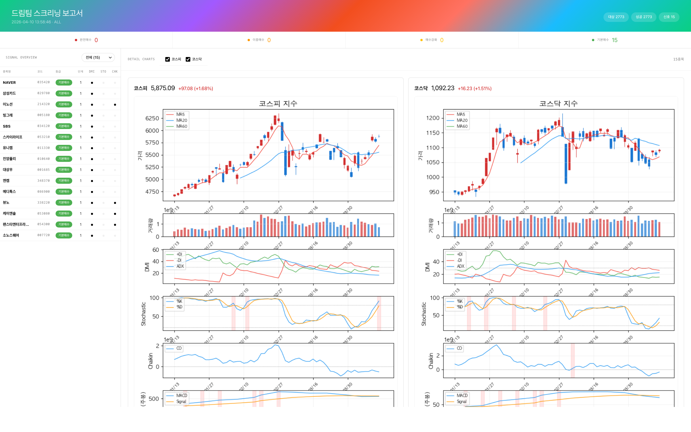

# StockHunter

박문환(샤프슈터) 드림팀 지표 기반 한국 주식 스크리너.

KRX(한국거래소) 상장 전 종목을 대상으로 드림팀의 5개 기술적 지표를 **순차적 복합조건**으로 분석하여 매수 신호를 탐지하고, 평일(거래일) 일간 배치로 HTML 리포트를 생성합니다. REST API로도 단건·다건 스크리닝을 제공합니다.

## 리포트 미리보기

<p align="center">
  
</p>

배치 실행 결과로 생성되는 HTML 리포트. 상단 등급 바와 좌측 Signal Overview 테이블에서 전체 신호 분포를 확인하고, 우측에 코스피·코스닥 지수 차트와 시그널 종목의 캔들스틱 + 5개 지표(거래량, DMI, 스토캐스틱, 채킨, MACD 주봉) 상세 차트가 순차 단계별로 표시됩니다.

## 핵심 특징

- **순차 4단계 복합조건**: 단순히 활성 지표 수를 세는 방식이 아니라, 드림팀 지표의 정해진 순서(DMI → 스토캐스틱 → 채킨 → MACD)대로 앞 단계가 충족되어야 다음 단계가 유효합니다. 중간 단계가 비어 있으면 그 이후 지표가 켜져도 카운트되지 않습니다.
- **YAML 중앙 설정**: 모든 지표 파라미터·룩백·리포트 필터를 `dream-index-config.yaml` 한 파일에서 관리합니다. 코드 수정 없이 튜닝 가능합니다.
- **전 종목 배치 파이프라인**: 2,700여 개 종목을 asyncio 배치로 스크리닝하고, 시그널 종목의 차트와 지수 차트를 생성해 단일 HTML 리포트로 묶어냅니다.
- **로컬 JSON 캐시**: KRX 호출 결과를 TTL 기반으로 캐싱해 반복 실행 속도를 크게 끌어올립니다.
- **테스트 커버리지**: 187개 단위·통합 테스트가 전체 파이프라인을 커버합니다.

## 드림팀 지표 체계

박문환의 《샤프슈터의 분석1 — 예술적 분석》에서 제시된 기술적 분석 복합 매매 시스템입니다. 이전 단계가 충족되어야 다음 단계로 진입할 수 있는 **순차적 AND 관계**가 핵심입니다.

| 단계 | 지표 | 개발자 | 역할 | 신호 조건 |
|------|------|--------|------|-----------|
| 1 | DMI | J. Welles Wilder | 저점 족집게 | -DI가 ADX를 30 이상에서 하향 돌파 + ADX 하락 전환 |
| 2 | 스토캐스틱 | George Lane | 매수 강화 확인 | Slow %K가 80 상향 돌파 |
| 3 | 채킨 오실레이터 | Marc Chaikin | 수급 확인 | 0선 상향 돌파 (매집 우위) |
| 4 | MACD 오실레이터 | Gerald Appel | 최종 매수 결정 | 주봉 오실레이터 양전환 |
| 보완 | TD Sequential | Tom DeMark | 전환점 예측 | Setup 9 또는 Countdown 13 완성 |

**신호 등급 (순차 단계 기반)**

| 등급 | 도달 단계 | 충족 지표 | 의미 |
|------|----------|-----------|------|
| 기본매수 | 1단계 | DMI | 신호 발생, 아직 완성 아님 |
| 매수강화 | 2단계 | DMI + 스토캐스틱 | 2단 이상 상승 기대 |
| 이중매수 | 3단계 | DMI + 스토캐스틱 + 채킨 | 자신감 있는 매수 가능 |
| 완전매수 | 4단계 | 4개 지표 모두 순차 충족 | 매수 신호 "완벽하게 무르익음" |

드마크는 보완 지표로 순차 단계에 포함되지 않으며, 리포트에는 별도 dot으로 표시됩니다.

## 설치

Python 3.11 이상이 필요합니다.

```bash
# 기본 설치 (배치/리포트/스크리너)
pip install -e .

# API 서버 포함
pip install -e ".[api]"

# 개발 환경 (테스트 포함)
pip install -e ".[api,dev]"
```

## 빠른 시작

### 0. 초기 캐시 준비 (최초 실행 권장)

저장소에 포함된 `stock-cache.zip`(약 16 MB, 압축 해제 시 약 143 MB)은 KRX에서 수집한 전 종목 일봉·주봉과 지수 데이터를 담고 있습니다. 최초 실행 시 이 파일을 풀어 두면 전 종목 배치가 **수 분 → 수십 초**로 단축됩니다.

```bash
# 저장소 루트에서 한 번만 실행
unzip stock-cache.zip
```

압축 해제 후에는 프로젝트 루트에 `.cache/` 디렉터리가 생성되며, 2,800여 개의 JSON 캐시 파일이 자리잡습니다. 캐시는 TTL 기반으로 24시간 후 자동 갱신되므로, 오래된 데이터는 배치 실행 시 KRX에서 다시 받아와 덮어씁니다. 압축 파일은 풀고 나면 지우셔도 무방합니다.

> 이미 `.cache/` 디렉터리가 존재한다면 압축 해제 시 파일이 덮어쓰기 되므로, 로컬 수정본이 있다면 미리 백업하세요. 완전히 새 환경에서 처음부터 수집하려면 `stock-cache.zip`을 풀지 말고 바로 다음 단계의 배치를 실행하면 됩니다. 첫 전 종목 스크리닝은 KRX API 호출이 많아 상당한 시간이 걸립니다(통상 10~30분).

### 1. 주간 배치 리포트 생성

```bash
# 기본 실행 (ALL 시장, 배치 크기 50, 동시 3개)
python -m src.batch

# 환경변수로 조정
MARKET=KOSPI BATCH_SIZE=100 MAX_CONCURRENT=5 python -m src.batch
```

실행 결과:
- `reports/YYYY-MM-DD/report.html` — 종합 HTML 리포트 (지수 차트 + 종목별 카드)
- `reports/YYYY-MM-DD/charts/*.png` — 시그널 종목 차트 + 코스피/코스닥 지수 차트

자동 스케줄 실행을 원하면 `scripts/run_batch.sh`를 launchd/cron에 등록하세요.

### 일간 리포트 자동 배포 (GitHub Actions + Pages)

`.github/workflows/daily-report.yml`이 평일(월~금) 16:00 KST(한국장 마감 후)에 자동으로 배치를 실행하고 결과를 GitHub Pages에 배포합니다. 한국 증시 휴일(임시휴장 포함)은 `pykrx`로 거래일 여부를 확인해 자동으로 건너뜁니다.

- **공개 URL**: https://knext.github.io/StockHunter/ (최신 리포트 바로가기 + 최근 10개 이력)
- **수동 트리거**: GitHub → Actions → `Daily Dream Team Report` → `Run workflow` (휴일에도 강제 실행 가능)
- **보존 정책**: `scripts/build_index.py`가 최신 10개 리포트 폴더만 남기고 자동 정리
- **캐시**: `actions/cache`로 `.cache/`를 일간 단위로 롤링 저장. 첫 실행은 `stock-cache.zip`에서 시드

GitHub Pages 최초 활성화: 저장소 Settings → Pages → Source를 `gh-pages` 브랜치 `/` (root)로 설정합니다. 워크플로우가 처음 성공하면 `gh-pages` 브랜치가 자동 생성됩니다.

### 2. API 서버 실행

```bash
python -m src.main
# 또는
uvicorn src.main:app --host 0.0.0.0 --port 8000 --reload
```

- Swagger UI: http://localhost:8000/docs
- 헬스체크: http://localhost:8000/health

## 설정 — dream-index-config.yaml

드림팀 지표의 모든 파라미터와 리포트 필터 임계값을 YAML 한 파일에서 관리합니다. 프로젝트 루트의 `dream-index-config.yaml`이 기본 경로이며, 환경변수 `DREAM_INDEX_CONFIG_PATH`로 다른 경로를 지정할 수 있습니다.

```yaml
indicators:
  # 1단계: DMI (저점 족집게) — 일봉 기준
  dmi:
    period: 14
    lookback_days: 5

  # 2단계: 스토캐스틱 (매수 강화 확인) — 일봉 기준
  stochastic:
    k: 14
    d: 3
    slowing: 3
    lookback_days: 5

  # 3단계: 채킨 오실레이터 (수급 확인) — 일봉 기준
  chaikin:
    fast: 3
    slow: 10
    lookback_days: 5

  # 4단계: MACD 오실레이터 (최종 매수 결정) — 주봉 기준
  macd:
    fast: 12
    slow: 26
    signal: 9

  # 보완: 드마크 TD Sequential — 일봉 기준
  demark:
    lookback: 4
    lookback_days: 5

report:
  # 리포트에 포함할 최소 순차 단계 (1-4)
  # 1: 기본매수 이상 | 2: 매수강화 이상 | 3: 이중매수 이상 | 4: 완전매수만
  min_strength: 3
```

**부분 override 지원**: YAML에 특정 섹션만 적어두면 나머지는 기본값을 사용합니다. 알 수 없는 키가 들어오거나 파싱 오류가 나면 경고 로그 후 기본값으로 안전하게 폴백합니다.

**사용 예**:

```bash
# 다른 설정 파일로 배치 실행
DREAM_INDEX_CONFIG_PATH=/path/to/my-dream.yaml python -m src.batch

# 완전매수만 보고 싶을 때: min_strength를 4로 수정 후 재실행
```

### 런타임/캐시 환경변수

| 환경변수 | 기본값 | 설명 |
|----------|--------|------|
| `DREAM_INDEX_CONFIG_PATH` | `dream-index-config.yaml` | 드림팀 YAML 설정 파일 경로 |
| `CACHE_DIR` | `.cache` | JSON 캐시 디렉토리 |
| `CACHE_TTL_HOURS` | `24` | 캐시 유효 시간 (시간) |
| `CACHE_MAX_HISTORY_DAYS` | `400` | `stock_data` 캐시 파일당 보존할 최대 과거 일수 (MACD 주봉 34주 + 버퍼) |
| `RATE_LIMIT_SECONDS` | `0.5` | KRX API 호출 간 최소 대기 (초) |
| `MARKET` | `ALL` | 배치 대상 시장 (`KOSPI`, `KOSDAQ`, `ALL`) |
| `BATCH_SIZE` | `50` | 배치당 종목 수 |
| `MAX_CONCURRENT` | `3` | 동시 실행 배치 수 |
| `HOST` | `0.0.0.0` | API 서버 바인드 주소 |
| `PORT` | `8000` | API 서버 포트 |

## REST API

### GET /api/screen

드림팀 스크리닝을 실행합니다. 전 종목 또는 쉼표 구분 종목코드 목록을 처리합니다.

| 파라미터 | 타입 | 기본값 | 설명 |
|----------|------|--------|------|
| `market` | string | `ALL` | `KOSPI`, `KOSDAQ`, `ALL` |
| `codes` | string | — | 쉼표 구분 종목코드 (예: `005930,000660`) |
| `min_strength` | int | `1` | 최소 순차 단계 (1–4) |
| `days` | int | `200` | 과거 데이터 일수 |

```bash
# 전 종목 스크리닝
curl "http://localhost:8000/api/screen"

# 특정 종목만 스크리닝
curl "http://localhost:8000/api/screen?codes=005930,000660"

# KOSPI 이중매수 이상만
curl "http://localhost:8000/api/screen?market=KOSPI&min_strength=3"
```

### GET /api/stocks/{code}

개별 종목의 5개 지표 최신값과 드림팀 순차 단계 결과를 반환합니다.

```bash
curl "http://localhost:8000/api/stocks/005930"
```

### GET /api/indicators

현재 로드된 `dream-index-config.yaml`의 지표 설정값을 조회합니다.

```bash
curl "http://localhost:8000/api/indicators"
```

## 프로젝트 구조

```
StockHunter/
├── dream-index-config.yaml    # 드림팀 지표 중앙 설정
├── pyproject.toml
├── README.md
├── scripts/
│   ├── run_batch.sh           # 주간 배치 실행 스크립트 (launchd/cron용)
│   └── test_100.py            # 상위 100종목 스모크 테스트
├── src/
│   ├── api/
│   │   ├── app.py             # FastAPI 앱 생성
│   │   ├── routes.py          # REST API 라우트
│   │   ├── schemas.py         # Pydantic 응답/요청 모델
│   │   └── dependencies.py    # 의존성 주입
│   ├── batch/
│   │   ├── runner.py          # 전 종목 배치 파이프라인 (asyncio)
│   │   ├── __main__.py        # `python -m src.batch` 엔트리포인트
│   │   └── types.py           # BatchResult 타입
│   ├── data/
│   │   ├── krx.py             # KRX 데이터 수집 (pykrx)
│   │   └── cache.py           # JSON 파일 기반 TTL 캐시
│   ├── indicators/
│   │   ├── dmi.py             # DMI (1단계)
│   │   ├── stochastic.py      # 스토캐스틱 (2단계)
│   │   ├── chaikin.py         # 채킨 오실레이터 (3단계)
│   │   ├── macd.py            # MACD 오실레이터 주봉 (4단계)
│   │   └── demark.py          # TD Sequential (보완)
│   ├── screener/
│   │   ├── dream_config.py    # YAML 설정 로더
│   │   ├── engine.py          # 순차 복합조건 스크리닝 엔진
│   │   └── types.py           # DreamTeamSignal 타입
│   ├── report/
│   │   ├── generator.py       # HTML 리포트 생성
│   │   ├── templates.py       # HTML/CSS 템플릿
│   │   └── types.py           # ReportConfig 타입
│   ├── visualization/
│   │   ├── chart.py           # 캔들스틱 + 지표 오버레이 차트
│   │   └── styles.py          # matplotlib 스타일
│   ├── types/
│   │   ├── stock.py           # StockInfo 타입
│   │   └── ohlcv.py           # OHLCV, StockData 타입
│   ├── config.py              # 런타임/캐시 환경변수 설정
│   └── main.py                # API 서버 엔트리포인트
├── tests/                     # pytest 단위·통합 테스트 (187개)
├── reports/YYYY-MM-DD/        # 배치 실행 결과물
└── logs/                      # 배치 실행 로그
```

## 테스트

```bash
# 전체 테스트 실행
pytest

# 특정 모듈만
pytest tests/test_engine.py tests/test_dream_config.py -v

# 커버리지 보고 (옵션)
pytest --cov=src --cov-report=term-missing
```

## 동작 예시

스크리닝 엔진의 순차 로직:

```python
from src.screener.dream_config import load_dream_index_config
from src.screener.engine import _sequential_stage

config = load_dream_index_config()  # dream-index-config.yaml 로드

# 정상 순차 충족
_sequential_stage(dmi=True, stoch=True, chaikin=True, macd=True)   # → 4 (완전매수)
_sequential_stage(dmi=True, stoch=True, chaikin=False, macd=False) # → 2 (매수강화)

# 순차 위반은 하위 단계로 차단
_sequential_stage(dmi=False, stoch=True, chaikin=True, macd=True)  # → 0 (신호 없음)
_sequential_stage(dmi=True, stoch=False, chaikin=True, macd=True)  # → 1 (DMI만 유효)
```

## 주의사항

- 본 프로그램은 기술적 분석 보조 도구입니다. 투자 판단의 최종 책임은 사용자에게 있으며, 결과에 대한 책임을 지지 않습니다.
- KRX 데이터는 pykrx 라이브러리를 통해 수집되며, 데이터의 정확성을 보장하지 않습니다.
- 과거 지표 신호가 미래 수익을 보장하지 않습니다.
- 전 종목 배치는 KRX API 호출량이 많습니다. 최초 실행 시 수 분이 소요될 수 있으며, 캐시 적중 이후에는 수십 초 내에 완료됩니다.
- 드림팀 지표는 박문환 저서에서 공개된 복합 매매 시스템을 참고해 구현한 것으로, 원서의 정확한 파라미터와 차이가 있을 수 있습니다. `dream-index-config.yaml`에서 자유롭게 튜닝하여 사용하세요.

## 참고 자료

- 박문환, 《(30여년의 실전 경험을 통한) 샤프슈터의 분석1 — 예술적 분석》, 행복을여는사람들, 2019.
- 박문환, 《(핵심지표 몇 가지만으로 기업의 내면을 속속들이 볼수 있는) 샤프슈터의 분석2 — 기업분석》, 행복을여는사람들, 2019.
- J. Welles Wilder, 《New Concepts in Technical Trading Systems》, 1978.

## 라이선스

이 저장소는 학습·연구 목적의 오픈소스 프로젝트입니다. 상업적 이용 전에는 박문환 저서 및 각 지표 원저작자의 저작권을 확인하시기 바랍니다.
